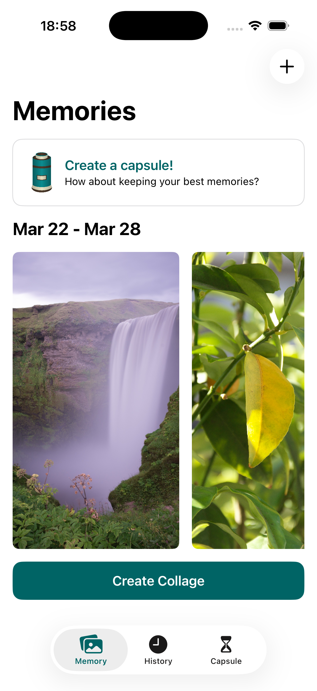
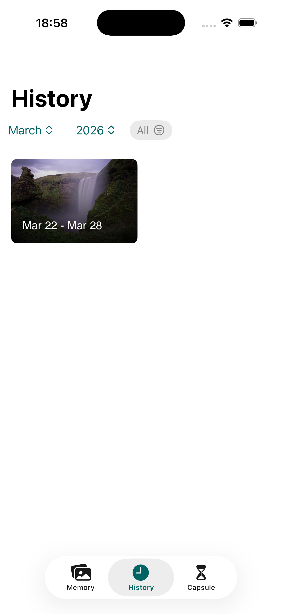
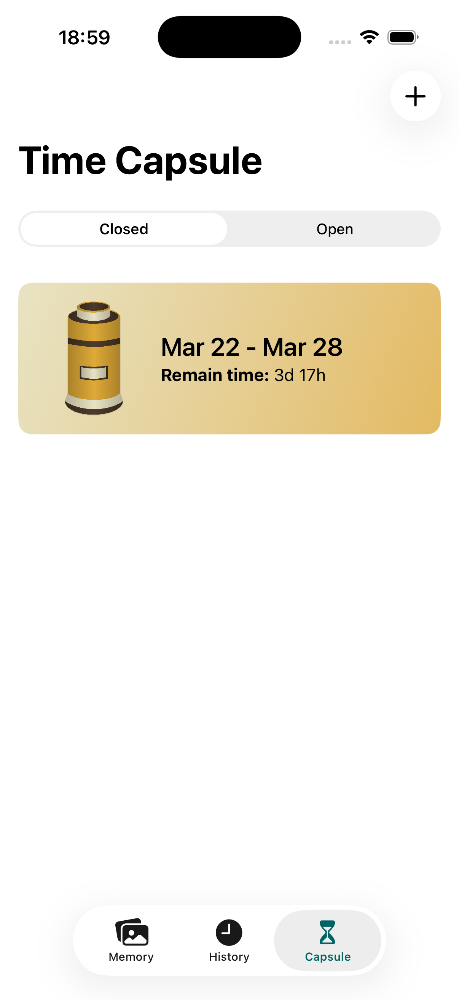

# ⏳ Kairos

---

## 📚 Sobre o Projeto

O **Kairos** é um aplicativo iOS focado em capturar e preservar **boas memórias**, permitindo que o usuário organize momentos especiais, crie colagens personalizadas e construa cápsulas do tempo digitais.

A proposta do app é transformar experiências cotidianas em registros significativos e duradouros.

---

## ✨ Features

- 🗓️ **Memórias semanais**  
  Registre momentos da sua semana com fotos e músicas, criando uma narrativa pessoal contínua  

- 🎨 **Colagens personalizadas**  
  Transforme suas memórias em colagens visuais com stickers e elementos customizáveis  

- 🗂️ **Histórico organizado**  
  Acesse todas as suas memórias estruturadas por mês e ano  

- ⏳ **Cápsulas do tempo**  
  Crie cápsulas com memórias da semana atual para revisitar no futuro  

---

## 🖼️ Preview do App

  
  
  

---

## 🛠️ Tecnologias Utilizadas

- 🔵 **Swift**
- 🔵 **SwiftUI**
- 🔵 **MusicKit**
- 🔵 **SwiftData**

---

## 👥 Equipe

Este projeto foi desenvolvido em colaboração com:

- Anna Martuti  
- Letícia Marini  
- Lucas Peixoto  
- Ludvik de Paula  
- Vidal Bernal  

---

## 🔗 Repositório

